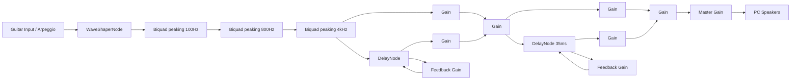

# BOSS ME-25 Web Editor & Librarian - Documentação do Desenvolvedor

Esta documentação detalha a engenharia reversa realizada nas mensagens de System Exclusive (SysEx) da pedaleira **BOSS ME-25**, o mapeamento de parâmetros decodificados, a estrutura de arquivos, as integrações nativas de sistema, o motor de áudio virtual e as instruções de uso do software desenvolvido.

---

## 1. Mapeamento de Parâmetros (Patch Memory Map)

A pedaleira BOSS ME-25 armazena e transmite patches como um bloco contínuo de **128 bytes** (payload). 
- Os primeiros **96 bytes** representam **48 parâmetros** individuais, estruturados em palavras de 16 bits (Big-Endian). Como a pedaleira utiliza valores de 7 bits (0-127), o primeiro byte de cada par é sempre `0x00`, e o segundo byte armazena o valor do parâmetro.
- Os últimos **32 bytes** representam o nome do patch (16 caracteres, também estruturados em palavras de 16 bits Big-Endian).

Aqui está o mapeamento completo dos 48 parâmetros (**P0** a **P47**) identificados e controlados pela aplicação:

| Parâmetro | Mapeamento no Bloco | Descrição do Efeito / Parâmetro | Valores Possíveis |
| :--- | :--- | :--- | :--- |
| **P0** | `payload[1]` | COMP/FX Switch | `0` = Off, `1` = On |
| **P1** | `payload[3]` | COMP/FX Type | `0` = COMP, `1` = T.WAH UP, `2` = T.WAH DOWN, `3` = SLOW GEAR, `4` = DEFRETTER, `5` = Single > Hum, `6` = Hum > Single, `7` = SOLO |
| **P2** | `payload[5]` | COMP/FX Sustain/Sens | `0 - 99` |
| **P3** | `payload[7]` | COMP/FX Attack/Tone | `0 - 99` |
| **P4** | `payload[9]` | COMP/FX Level | `0 - 99` |
| **P5** | `payload[11]` | OD/DS Switch | `0` = Off, `1` = On |
| **P6** | `payload[13]` | OD/DS Type | `0` = BOOST, `1` = OD-1, `2` = T-SCREAM, `3` = BLUES, `4` = DIST, `5` = CLASSIC, `6` = MODERN, `7` = METAL, `8` = CORE, `9` = FUZZ |
| **P7** | `payload[15]` | OD/DS Drive | `0 - 99` |
| **P8** | `payload[17]` | OD/DS Tone | `0 - 99` |
| **P9** | `payload[19]` | OD/DS Level | `0 - 99` |
| **P10** | `payload[21]` | MODULATION Switch | `0` = Off, `1` = On |
| **P11** | `payload[23]` | MODULATION Type | `0` = CHORUS, `1` = FLANGER, `2` = PHASER, `3` = TREMOLO, `4` = ROTARY, `5` = UNI-V, `6` = HARMONIST, `7` = DELAY |
| **P12** | `payload[25]` | MODULATION Rate/Key | `0 - 99` |
| **P13** | `payload[27]` | MODULATION Depth/Harmony | `0 - 99` |
| **P14** | `payload[29]` | MODULATION Level | `0 - 99` |
| **P15** | `payload[31]` | MODULATION Resonance | `55` (Constante de ressonância ou controle extra) |
| **P16** | `payload[33]` | DELAY Switch | `0` = Off, `1` = On |
| **P17** | `payload[35]` | DELAY Type | `1` (Constante recomendada para padrão) |
| **P18** | `payload[37]` | DELAY Time (MSB) | `0 - 127` (Parte alta do tempo em ms) |
| **P19** | `payload[39]` | DELAY Time (LSB) | `0 - 127` (Parte baixa do tempo em ms) |
| **P20** | `payload[41]` | DELAY Feedback | `0 - 99` |
| **P21** | `payload[43]` | DELAY Level | `0 - 120` |
| **P22** | `payload[45]` | PREAMP Switch | `0` = Off, `1` = On |
| **P23** | `payload[47]` | PREAMP Type (COSM Model) | `0` = CLEAN, `1` = TWIN, `2` = TWEED, `3` = CRUNCH, `4` = COMBO, `5` = DRIVE, `6` = STACK, `7` = METAL, `8` = LEAD, `9` = EXTREME |
| **P24** | `payload[49]` | PREAMP Gain | `0 - 99` |
| **P25** | `payload[51]` | PREAMP Bass | `0 - 99` |
| **P26** | `payload[53]` | PREAMP Middle | `0 - 99` |
| **P27** | `payload[55]` | PREAMP Treble | `0 - 99` |
| **P28** | `payload[57]` | PREAMP Presence | `0 - 99` |
| **P29** | `payload[59]` | PREAMP Level | `0 - 99` |
| **P30** | `payload[61]` | SOLO Switch | `0` = Off, `1` = On |
| **P31** | `payload[63]` | Noise Suppressor (NS) Threshold | `0 - 99` |
| **P32** | `payload[65]` | Pedal FX Type | `0` = Volume, `1` = WAH, `2` = +1 OCT, `3` = -1 OCT, `4` = FREEZE |
| **P33 - P34** | `payload[67 - 69]` | Reservados / Auxiliares | `0` |
| **P35** | `payload[71]` | Master Volume | `0 - 99` |
| **P36** | `payload[73]` | Parâmetro auxiliar | `90` |
| **P37** | `payload[75]` | Super Stack Switch | `0` = Off, `1` = On |
| **P38** | `payload[77]` | Parâmetro auxiliar | `1` |
| **P39 - P40** | `payload[79 - 81]` | Reverb Coeficientes Auxiliares | `P39 = 50`, `P40 = 10` |
| **P41** | `payload[83]` | REVERB Decay | `0 - 99` |
| **P42** | `payload[85]` | REVERB Type | `0` = ROOM, `1` = HALL |
| **P43** | `payload[87]` | REVERB Level | `0 - 99` |
| **P44 - P47** | `payload[89 - 95]` | Reservados | `P44 = 0`, `P45 = 4`, `P46 = 0`, `P47 = 0` |

---

## 2. Estrutura do Pacote MIDI SysEx (BOSS / Roland)

Todas as comunicações com a pedaleira usam o protocolo Roland SysEx:

```
F0 41 10 00 00 45 CMD [Endereço (4 bytes)] [Dados...] Checksum F7
```

- **`F0`**: Início de Mensagem SysEx.
- **`41`**: ID da fabricante (Roland/BOSS).
- **`10`**: Device ID.
- **`00 00 45`**: Model ID exclusivo da BOSS ME-25.
- **`CMD`**: Comando da mensagem:
  - `0x11` (RQ1) = Requisição de leitura.
  - `0x12` (DT1) = Escrita/Transferência de dados.
- **`Endereço`**: Endereço de destino na memória:
  - `20 00 00 00` = Edit Buffer ativo.
  - `7F 00 [slotIdx] 00` = Endereço do slot de memória gravável.
- **`Checksum`**: Byte de integridade, calculado sobre os bytes de endereço e dados.
  
### Cálculo de Checksum
O Checksum é calculado somando os bytes de endereço e dados, dividindo a soma por 128 e extraindo o resto. O checksum final é dado por `128 - resto` (se o resto for 0, o checksum é 0).

---

## 3. Real-Time Parameter Control (Controle em Tempo Real)

A BOSS ME-25 possui uma limitação de firmware: **ela não aceita comandos de gravação de parâmetros individuais** (como enviar atualizações parciais de 2 bytes para um endereço específico de offset). Qualquer mensagem SysEx menor que 141 bytes direcionada ao edit buffer é sumariamente ignorada pelo dispositivo, impossibilitando a alteração fracionada.

Portanto, o controle em tempo real é feito enviando o **bloco completo de 128 bytes** (payload de 141 bytes totais incluindo endereço e overhead de protocolo) para o endereço do edit buffer ativo (`20 00 00 00`) sempre que um parâmetro for alterado.

Para evitar sobrecarga (MIDI choke) no processador da pedaleira ao mover os sliders rapidamente, foi implementado um mecanismo de **Throttling** (limitação de taxa) que retém e agrupa os pacotes MIDI a uma taxa de envio de segurança de no máximo **uma vez a cada 60ms**.

---

## 4. Endereçamento dos Slots de Memória (60 slots de Usuário)

O espaço de memória gravável da pedaleira (User Memory) é representado sequencialmente na faixa de endereços SysEx de **`7F 00 00 00`** a **`7F 00 3B 00`** (60 slots correspondendo aos bancos **U01-1 a U20-3**).

Fórmula de cálculo de endereço para leitura ou gravação de slot:
$$\text{Endereço} = \text{[0x7F, 0x00, slotIdx, 0x00]}$$
Onde `slotIdx` vai de `0` (U01-1) a `59` (U20-3).

---

## 5. Importação Dinâmica de Timbres (Formatos .TSL, .M2L, .KSD e .NGRR)

A aplicação integra bibliotecas externas provenientes de softwares populares e simuladores de terceiros através de IPC no Electron:

### 5.1. Arquivos FxFloorBoard (`.m2l`)
Carregados a partir do diretório local `C:\FxFloorBoard\ME-25-Edit\saved_patches`.
- **Cabeçalho**: Deve iniciar com a string ASCII `ME2LibrarianFile`.
- **Leitura do Nome**: O nome do patch é codificado em UTF-16BE (2 bytes por caractere) no offset constante `104` a `140`. Caso ausente, é feito um escaneamento linear por caracteres ASCII válidos.
- **Parâmetros**: Extraídos a partir de blocos de 16 bits Big-Endian a partir do offset `12` do arquivo, avançando de 2 em 2 bytes e pulando os 4 primeiros parâmetros de metadados do software FxFloorBoard.

### 5.2. Arquivos BOSS Tone Studio (`.tsl`)
Carregados do diretório do AppData do Windows em `BOSS-TONE-STUDIO-for-ME-25\Local Store\livesets`.
- **Formato**: JSON estruturado contendo a lista `patchList`.
- **Parâmetros**: Mapeados como uma string hexadecimal no objeto `params.paramData`. A aplicação lê os pares hexadecimais de 2 em 2 caracteres, extraindo valores de 16 bits para reconstruir o vetor de 48 parâmetros.

### 5.3. Presets do Guitar Rig (`.ksd` e `.ngrr`)
Extraídos e convertidos a partir de arquivos de preset das versões Guitar Rig 4 (`.ksd`) e Guitar Rig 5 (`.ngrr`).
- **Formato do Container (NI Container)**: Arquivo binário estruturado com blocos comprimidos via `zlib` sob tags invertidas (ex: `dnss` para `ssnd`, `ofni` para `info`, `tsrp` para `prst`).
- **Extração da Cadeia**: O rack completo com componentes ativos e parâmetros decimais (entre `0.0` e `1.0`) é lido a partir do bloco de configuração XML do rack (`prst`).
- **Mapeamento de Efeitos**: Os componentes ativos (Compressores, Amplificadores, Distorções, Modulações, Delays, Reverbs e Noise Gates) são convertidos para as posições físicas equivalentes no mapa de 128 bytes (48 parâmetros) da BOSS ME-25.
- **Compilação e Otimização**: Uma pré-compilação em lote varre a pasta local e gera o arquivo unificado `guitar_rig_presets.json` para carregamento concorrente instantâneo (menos de 20ms) na inicialização da janela do editor.

---

## 6. Sistema de Librarian Total (Backup & Restauração)

O Librarian implementa operações em massa com a memória flash da pedaleira:

### 6.1. Backup Total (60 slots)
- Envia solicitações `RQ1` (`0x11`) sequencialmente do slot `0` ao `59`.
- O tamanho solicitado no pacote SysEx é de `00 00 01 0D` (141 bytes, correspondente ao pacote completo do preset).
- Possui um mecanismo de **timeout de 450ms** com autorretry caso a pedaleira falhe em responder devido a ruído ou buffer cheio.
- Adiciona um **atraso de 50ms** entre leituras de slots para estabilizar a comunicação.
- Gera um arquivo `.me25backup` contendo a serialização em JSON dos nomes e parâmetros.

### 6.2. Restauração Total
- Solicita o upload do arquivo de backup `.me25backup`.
- Envia comandos de escrita `DT1` (`0x12`) com payloads reconstruídos de 128 bytes para os endereços `7F 00 [slotIdx] 00`.
- É obrigatório um **atraso de 100ms** entre gravações de slots consecutivos, concedendo o tempo necessário para o chip de memória flash física da pedaleira persistir os dados.

---

## 7. Modo DAW (Bypass de Sinal)

Projetado para gravação direta em computadores, o modo DAW desativa fisicamente todos os blocos de processamento da pedaleira para que ela funcione como uma interface de áudio neutra, permitindo que plugins de simulação (como Neural DSP ou AmpliTube) processem o sinal de entrada seco.

Ao ativar o Modo DAW, a aplicação:
1. Salva o estado do patch ativo na memória.
2. Configura os parâmetros de bypass no vetor de patch:
   - `P0` (COMP/FX) = `0` (Off)
   - `P5` (OD/DS) = `0` (Off)
   - `P10` (MODULATION) = `0` (Off)
   - `P16` (DELAY) = `0` (Off)
   - `P22` (PREAMP) = `0` (Off)
   - `P30` (SOLO) = `0` (Off)
   - `P31` (NS Threshold) = `0` (Off)
   - `P37` (Super Stack) = `0` (Off)
   - `P43` (Reverb Level) = `0` (Off)
   - `P35` (Master Volume) = `99` (Level máximo de entrada USB)
3. Envia os dados e esmaece visualmente os cards de efeitos na UI.
4. Ao desativar o Modo DAW, o patch original previamente salvo é retransmitido, restabelecendo as conexões físicas.

---

## 8. Engine de Áudio Virtual (Web Audio API)

A aplicação conta com um processador de simulação de áudio local integrado no navegador, útil tanto para ouvir o sinal da guitarra ao vivo quanto para testar alterações nos knobs sem hardware conectado através de um gerador de arpejos integrado.

### 8.1. Cadeia de Roteamento de Áudio


### 8.2. Mapeamento de Simulação Local
- **OD/DS (Distorção)**: Ativa um `WaveShaperNode` cuja curva de saturação sigmoidal é calculada dinamicamente com base no valor de `P7` (Drive) multiplicado por um fator de `1.6`.
- **Preamp / EQ**: Ajusta o ganho de três filtros do tipo peaking (Graves a 100Hz, Médios a 800Hz, Agudos a 4000Hz). Mapeia os valores de 0-99 dos parâmetros de EQ para uma variação de ganho real entre `-12dB` e `+12dB`.
- **Delay**: Modula o tempo do `DelayNode` convertendo MSB (`P18`) e LSB (`P19`) in milissegundos (máximo de 2.0s). O feedback (`P20`) mapeia de 0-99 para `0.0 a 0.75` de ganho. A intensidade de wet (`P21`) mapeia de 0-120 para `0.0 a 0.8`.
- **Reverb**: Utiliza um delay curto fixo em 35ms para reflexões rápidas de sala. O decay (`P41`) mapeia para ganho de realimentação de `0.0 a 0.75`, e o nível (`P43`) controla a saída wet de `0.0 a 0.6`.
- **Gravação Direta**: Solicita áudio bruto do dispositivo de entrada (driver de gravação USB da pedaleira) configurando restrições de latência ultra-baixa (`latency: 0.01`, sem cancelamento de eco, controle de ganho ou supressão de ruídos).

### 8.3. Configuração e Guia de Uso de Áudio Local (Monitoramento de Guitarra)
Para tocar guitarra diretamente no PC e processar o som com o motor de áudio virtual do software, siga as etapas abaixo:
1. **Conexões Físicas**:
   - Conecte a guitarra na entrada **INPUT** da **BOSS ME-25**.
   - Conecte a pedaleira via **cabo USB** no computador.
   - Conecte seus fones de ouvido ou caixas de som diretamente na **saída de som do computador** (placa de som padrão).
2. **Configuração do Sistema Operacional**:
   - Defina a pedaleira **BOSS ME-25** como o **Dispositivo de Gravação (Entrada) Padrão** nas configurações de som do Windows.
   - Defina as caixas ou fones do PC como o **Dispositivo de Reprodução (Saída) Padrão**.
3. **Configuração da Pedaleira**:
   - Para evitar ouvir o som físico processado da pedaleira simultaneamente ao áudio do PC, selecione o preset de bypass total **`Direct / DAW Out (Bypass)`** (disponível na aba **Fábrica**).
4. **Ativação no Software**:
   - No painel lateral do editor virtual, localize o card **Modo DAW / Interface** e ligue o switch **🎸 Processar Áudio Local no PC**.
   - O áudio limpo da guitarra será capturado pela porta USB e processado de forma autônoma pelos filtros e blocos ativos no painel do editor, gerando o som mixado nas caixas do computador.

---

## 9. Modos de Operação Multi-Tela (Popup Library)

Usando recursos do Electron, a biblioteca de timbres pode ser desmembrada em uma janela flutuante separada:
- A Janela Principal dispara `open-library-window` via IPC.
- O Electron abre uma nova janela carregando `index.html?mode=library` posicionada e dimensionada separadamente.
- O CSS ativa a classe `.library-window-mode` que reposiciona os componentes e esconde as seções de edição para otimizar o espaço para drag/drop e gerenciamento visual de patches.
- Cliques na tela de biblioteca enviam mensagens `library-select-patch` devolvendo os dados do timbre de volta à janela do editor principal via IPC, disparando a atualização da UI e o envio de MIDI.

---

## 10. Persistência de Sessão e Utilitários de Busca

### 10.1. Persistência e Autosave
Sempre que um parâmetro do patch atual é alterado na tela, o estado do patch é imediatamente salvo em `localStorage` sob a chave `boss_me25_session_patch`. Ao inicializar a aplicação, esse estado é lido e restaurado, evitando perda de progresso em caso de fechamento acidental.

### 10.2. Busca de Timbres (Library Search)
Pesquisa em tempo real pelo nome nos conjuntos de presets de Fábrica, Nuvem e Pastas locais. Pastas e bibliotecas do FxFloorboard que possuam correspondências com o termo digitado são automaticamente expandidas e destacadas com comportamento acordeão sanfonado.

### 10.3. Busca de Efeitos (Effects Search)
Um índice mapeado dos modelos de amplificadores e efeitos de modulação/distorção (`SEARCHABLE_EFFECTS`) permite a busca instantânea de blocos específicos. Ao selecionar um efeito no console de busca:
1. O switch de ativação do efeito é ligado (`change` event).
2. O dropdown é alterado para o modelo selecionado (`input` event).
3. A janela faz scroll suave (`scrollIntoView`) centralizando o card do efeito na tela.
4. É disparada uma animação CSS de destaque temporário (`glow-highlight`) com duração de 1.5 segundos no cartão.

---

## 11. Separador de Faixas (Stems) & Controle de Equalização Multifaixas

A aplicação inclui um processador de separação de trilhas por Inteligência Artificial (Stems) e uma cadeia independente de equalização.

### 11.1. Controles Físicos das Trilhas (Stems)
Para cada uma das 4 trilhas decodificadas (**Voz**, **Bateria**, **Baixo**, **Guitarra/Outros**), a interface disponibiliza:
- **Fader de Volume (dB)**: Modula o volume em escala de decibéis (convertendo a entrada linear de 0-100 para dB correspondente de ganho).
- **Mute Independente**: Silencia instantaneamente a trilha associada.
- **Painel Colapsável de Equalização (Sliders)**:
  - **Filtro Passa-Alto (HPF)**: Variável entre 20 Hz e 1000 Hz.
  - **Filtro Passa-Baixo (LPF)**: Variável entre 2000 Hz e 20000 Hz.
  - **5 Bandas Paramétricas**: Graves, Médio-Graves, Médios, Médio-Agudos e Agudos com ajustes individuais de **Ganho (-15dB a +15dB)**, **Frequência** e **Fator Q (0.1 a 10.0)**.

### 11.2. Painel de Visualização do EQ Paramétrico (Beta)
- Localizado na seção inferior em um painel retrátil colapsável (`<details>`), está integrado um equalizador paramétrico de alta definição com renderização de gráfico em canvas 2D em tempo real.
- Permite arrastar os nós de frequência e ganho diretamente no gráfico, sincronizando instantaneamente com os sliders correspondentes de cada trilha.

### 11.3. Sincronização do Mixer em PIP (Multi-tela)
- O volume e status de mute das faixas são espelhados no painel mixer no modo Normal. No modo PIP, o mixer é ocultado, permitindo que a lista de faixas e equalizadores ocupem de forma otimizada todo o espaço de tela flutuante.

---

## 12. Histórico de Modificações e Novas Implementações (Versão 1.1.0)

Esta seção documenta a expansão massiva realizada no projeto (~4.500+ linhas de código adicionadas), transformando o editor básico em um ecossistema completo de estúdio musical virtual:

### 12.1. Lógica da Aplicação — [app.js](file:///C:/dev/BOSS_ME25/app.js)
- **Fluxo de Inicialização e Multi-Telas**: Implementação da detecção automática dos modos `player` (PIP Mixer) e `library` (Janela Popup).
- **Gerenciamento Global de Estado**: Adicionados os estados do player de stems, mapeamentos de volume em decibéis e configurações persistentes de temas e tamanhos de fonte no `localStorage`.
- **Cadeia de Áudio Virtual (Web Audio API)**: Implementação do mixer multifaixa para as stems separadas e captura local da guitarra com distorção por `WaveShaperNode` de curva sigmoidal, EQ de 3 bandas, Delay com sincronização MSB/LSB e Reverb curto (35ms).
- **Equalizador Paramétrico Dinâmico**: Criação de canais de áudio individuais para cada stem com filtros LPF, HPF e 5 bandas de EQ. Suporte a controle interativo de nós via `Canvas 2D` com renderização RTA (Real-Time Analyzer) em tempo real.
- **Mecanismos de Busca e Filtros de Timbre**: Adicionada busca de efeitos pelo catálogo `SEARCHABLE_EFFECTS` com rolagem suave (`scrollIntoView`) e animação visual de destaque (`glow-highlight`), além de filtragem dinâmica da biblioteca por efeitos mapeados em timbres de terceiros.

### 12.2. Design e Estilização — [style.css](file:///C:/dev/BOSS_ME25/style.css)
- **Design System Neon/Dark**: Criação de tokens CSS (HSL) para temas centralizados, controle global de fonte proporcional e estilos dedicados à interface de estúdio.
- **Mixer e Janelas Customizadas**: Estilização do painel de Stems Mixer, faders de volume de precisão, nós do equalizador e layouts específicos para o modo PIP (compacto) e modo biblioteca independente.
- **Micro-interações e Layouts de Abas**: Transições de abas, fluxo de sinal interativo na barra superior e realces de cards via classe de animação pulsante.

### 12.3. Integração de Processos e Backends — [main.js](file:///C:/dev/BOSS_ME25/main.js) & [preload.js](file:///C:/dev/BOSS_ME25/preload.js)
- **Operação de Telas Adicionais**: IPC listeners para gerenciar e persistir coordenadas e estados das janelas popup (`libraryWindow` e `playerWindow`).
- **Ponte para Processamento de IA (Stems)**: IPC handler `stem:separate` que inicia de forma assíncrona o executável nativo [separate_engine.exe](file:///C:/dev/BOSS_ME25/engine/separate_engine.exe) (processando via script Python [separate.py](file:///C:/dev/BOSS_ME25/tools/separate.py)) e transmite o progresso em tempo real ao renderer.
- **Bypass de Segurança CORS (YouTube)**: Regravação dinâmica dos cabeçalhos HTTP `Origin` e `Referer` para habilitar a reprodução segura de vídeos do YouTube em janelas locais Electron.
- **Segurança de Acesso e Permissões**: Permissão automática para dispositivos MIDI, envio de SysEx e captura de áudio direto da entrada padrão do Windows.

### 12.4. Estrutura e Interface — [index.html](file:///C:/dev/BOSS_ME25/index.html)
- **Interface de Estúdio (Studio View)**: Criação de uma nova aba principal contendo o painel do Mixer de Stems, o reprodutor de backing tracks e o contêiner interativo para visualização de Canvas.
- **Painel de Controle de Processamento por IA**: Formulário para seleção de arquivos de áudio locais, relatórios e barra de progresso do motor de stems.
- **Barra de Título Customizada**: Elementos e botões integrados para o controle nativo de janelas personalizadas.

### 12.5. Melhorias no Player & Biblioteca de Acompanhamento (Versão 1.1.1)
- **Reestruturação Física de Cards**: O painel **MINHAS TRILHAS** foi movido para fora do card de player de acompanhamento, tornando-se um card irmão independente (`#cardStemLibrary`) na Effects Grid do Modo Estúdio no [index.html](file:///C:/dev/BOSS_ME25/index.html).
- **Layout PIP Multitela em 3 Colunas**: No modo PIP (`body.player-window-mode`), a Effects Grid em [style.css](file:///C:/dev/BOSS_ME25/style.css) é exibida horizontalmente (`flex-direction: row`), organizando Player, Mixer e Biblioteca de Trilhas em 3 colunas lado a lado. O Separador de IA (`#stemSeparatorPanel`) é ocultado permanentemente neste modo.
- **Biblioteca Híbrida e Arquivos Soltos**: A biblioteca local no [main.js](file:///C:/dev/BOSS_ME25/main.js) realiza busca recursiva e aceita tanto pastas contendo as 4 stems de IA quanto arquivos de áudio avulsos comuns (`.mp3`, `.wav`, `.flac`, `.m4a`, `.aac`) soltos diretamente no diretório `separated`.
- **Reprodução Simplificada de Faixa Única**: Arquivos comuns de backing tracks são carregados em buffer único (modo `original`) em [app.js](file:///C:/dev/BOSS_ME25/app.js), possibilitando a reprodução direta e controle de volume global instantâneos, sem passar pelo processo de separação por IA.
- **Download Direto para a Biblioteca**: A exportação de stems individuais e de mixagens Minus-One em [app.js](file:///C:/dev/BOSS_ME25/app.js) salva diretamente na pasta correspondente no diretório de stems separadas (resolvido dinamicamente de forma relativa à instalação, ex: `C:\Dev\BOSS_ME25\BT\separated\`) de forma automatizada, sem exibir janelas dialog de salvamento do Windows, criando a pasta e indexando-a automaticamente se for nova.
